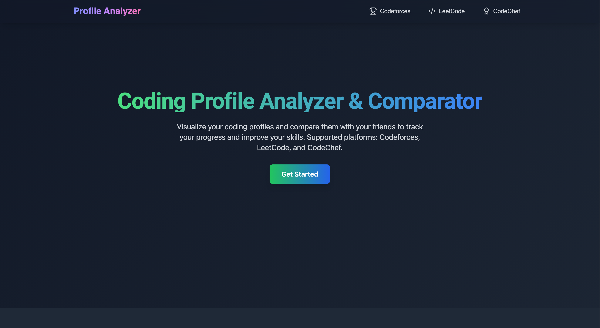
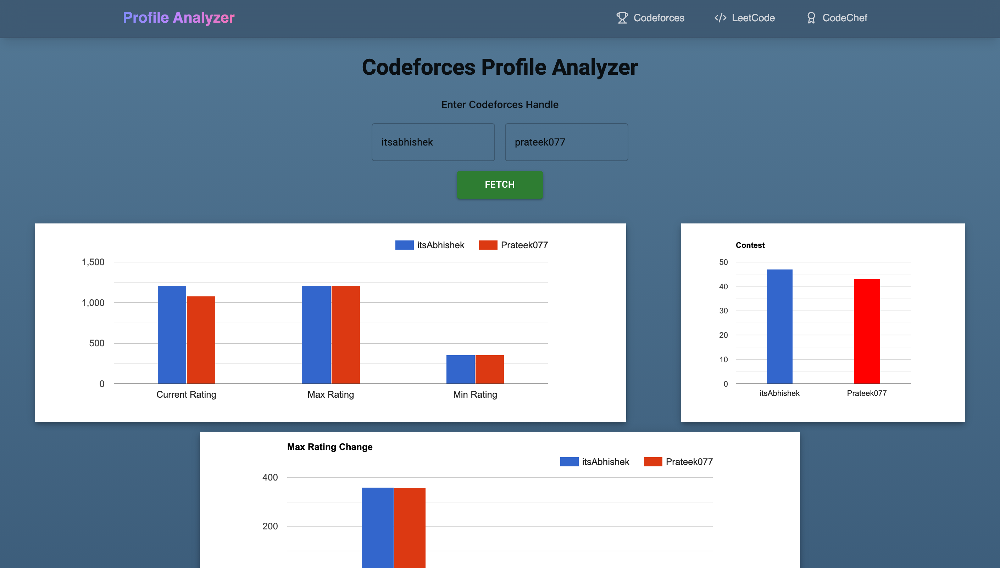

<p align="center">
  
</p>

# Dev-Compare

> Compare your competitive programming profiles across CodeChef, Codeforces, and LeetCode in one place!

---

## 🚀 Overview
Dev-Compare is a modern web application that allows users to view and compare their coding profiles from multiple platforms. It provides insightful visualizations and a unified dashboard for competitive programmers.

---

## ✨ Features
- 🔍 Compare profiles from CodeChef, Codeforces, and LeetCode
- 📊 Visualize stats with interactive charts
- ⚡ Fast and responsive UI built with React & Vite
- 🎨 Beautiful styling using Tailwind CSS
- 🌐 Easy navigation with a clean Navbar
- 🛠 Extensible for more platforms

---

## 🛠 Tech Stack
- **Frontend:** React
- **Build Tool:** Vite
- **Styling:** Tailwind CSS
- **Deployment:** Vercel
- **Charts:** Google Charts (via custom hook)

---

## 📦 Project Structure
```
Dev-Compare/
├── public/
│   ├── logo.png
│   ├── home.png
│   ├── cf.png
│   ├── lc.png
│   └── vite.svg
├── src/
│   ├── App.jsx
│   ├── main.jsx
│   ├── App.css
│   ├── index.css
│   ├── assets/
│   ├── components/
│   │   ├── Navbar.jsx
│   │   ├── Home.jsx
│   │   ├── CodeChefProfileCompare.jsx
│   │   ├── CodeforcesProfileCompare.jsx
│   │   ├── LeetCodeProfileCompare.jsx
│   │   ├── Testing.jsx
│   │   └── Charts/
│   │       └── useGoogleChart.js
│   └── lib/
│       └── codeforcesHelper.js
├── Temporary Api Data/
├── index.html
├── package.json
├── tailwind.config.js
├── postcss.config.js
├── vite.config.js
├── vercel.json
└── README.md
```

---

## 🖥️ Screenshots
<p align="center">
  
</p>
<p align="center">
  
</p>
<p align="center">
  
</p>

---

## ⚙️ Setup & Installation
1. **Clone the repository:**
	```bash
	git clone https://github.com/itsAbhishekpatel01/Dev-Compare.git
	cd Dev-Compare
	```
2. **Install dependencies:**
	```bash
	npm install
	```
3. **Start the development server:**
	```bash
	npm run dev
	```
4. **Open in browser:**
	Visit [http://localhost:5173](http://localhost:5173)

---

## 📝 Usage
- Enter your usernames for CodeChef, Codeforces, and LeetCode.
- View and compare your stats and achievements.
- Explore visual charts for deeper insights.

---

## 🧩 Extending the Project
To add support for another platform:
- Create a new comparison component in `src/components/`
- Add API integration logic in `src/lib/`
- Update navigation and state management as needed

---

## 🤝 Contributing
Contributions are welcome! Please open issues or submit pull requests for improvements and new features.

---

## 📄 License
This project is licensed under the MIT License.

---

## 🙋‍♂️ Author
**Abhishek Patel**  
[GitHub](https://github.com/itsAbhishekpatel01)
